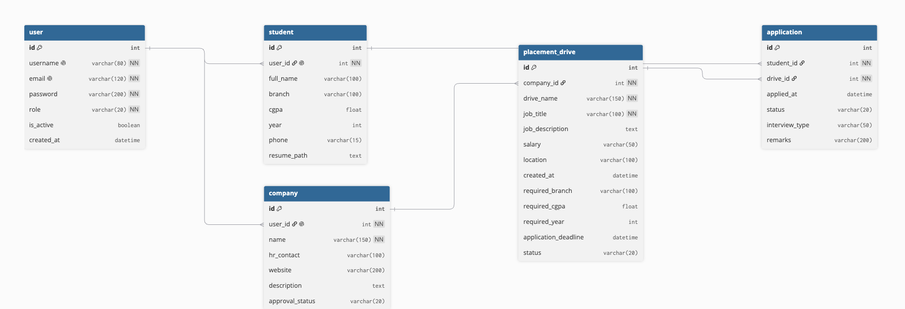

# Placement Portal Application

A full-stack web application for managing campus recruitment — built with Flask, Vue.js, Celery, and Redis.

---

## Overview

Institutes rely on spreadsheets and manual coordination for campus recruitment, making it difficult to manage company approvals, placement drives, student registrations, and application tracking.

This Placement Portal solves that with three distinct roles — **Admin**, **Company**, and **Student** — each with their own dashboard and permissions.

---

## Tech Stack

| Layer | Technology |
|-------|-----------|
| Backend | Flask (REST API) |
| Frontend | Vue.js 3 (CDN) + Bootstrap 5 |
| Database | SQLite + SQLAlchemy ORM |
| Authentication | JWT (Flask-JWT-Extended) |
| Background Jobs | Celery + Celery Beat |
| Message Broker | Redis |
| Caching | Flask-Caching (Redis) |
| Email | Flask-Mail (Gmail SMTP) |
| File Uploads | Werkzeug |

---

## Features

### Admin
- Dashboard with stats — total students, companies, drives, pending approvals
- Approve / reject / blacklist companies
- Approve / reject / close placement drives
- Activate / deactivate students
- Search companies and students
- View all applications across the platform

### Company
- Register company profile (requires admin approval)
- Create placement drives with eligibility criteria
- View and manage student applications
- Update application status — shortlisted, waiting, selected, rejected
- View student resumes

### Student
- Register, login, update profile
- Browse approved placement drives with search
- Apply for drives (eligibility validated — CGPA, branch, year)
- View application history and status
- Upload and view resume
- Export application history as CSV (delivered via email)

### Background Jobs
| Job | Trigger | Description |
|-----|---------|-------------|
| Daily Reminder | Every day at 10am | Emails students about upcoming deadlines |
| Monthly Report | 1st of every month | Emails admin an HTML activity report |
| CSV Export | User triggered | Emails student their application history |

---

## Database Schema

```
User (id, username, email, password, role, is_active)
  ├── Student (id, user_id FK, full_name, branch, cgpa, year, phone, resume_path)
  │     └── Application (id, student_id FK, drive_id FK, applied_at, status, interview_type, remarks)
  └── Company (id, user_id FK, name, hr_contact, website, description, approval_status)
        └── PlacementDrive (id, company_id FK, drive_name, job_title, job_description,
                            salary, location, required_branch, required_cgpa,
                            required_year, application_deadline, status)
```



**Relationships:**
- User → Student (one-to-one)
- User → Company (one-to-one)
- Company → PlacementDrive (one-to-many)
- Student → Application (one-to-many)
- PlacementDrive → Application (one-to-many)
- UniqueConstraint on (student_id, drive_id) prevents duplicate applications

---

## API Endpoints

### Auth
| Method | Endpoint | Description |
|--------|----------|-------------|
| POST | `/api/auth/login` | Authenticate user, return JWT token |
| POST | `/api/auth/register/student` | Register a new student |
| POST | `/api/auth/register/company` | Register a new company |

### Admin
| Method | Endpoint | Description |
|--------|----------|-------------|
| GET | `/api/admin/stats` | Dashboard stats (cached) |
| GET | `/api/admin/companies` | List all companies with search |
| PUT | `/api/admin/companies/<id>/status` | Approve / reject / blacklist company |
| GET | `/api/admin/students` | List all students with search |
| PUT | `/api/admin/students/<id>/status` | Activate / deactivate student |
| GET | `/api/admin/drives` | List all placement drives (cached) |
| PUT | `/api/admin/drives/<id>/status` | Approve / reject / close drive |
| GET | `/api/admin/applications` | View all student applications |

### Company
| Method | Endpoint | Description |
|--------|----------|-------------|
| GET | `/api/company/dashboard` | Company info and drives |
| POST | `/api/company/drives` | Create a placement drive |
| GET | `/api/company/drives/<id>/applications` | View applications for a drive |
| PUT | `/api/company/applications/<id>/status` | Update application status |

### Student
| Method | Endpoint | Description |
|--------|----------|-------------|
| GET | `/api/student/drives` | View approved drives with search |
| POST | `/api/student/drives/<id>/apply` | Apply for a drive |
| GET | `/api/student/applications` | View own application history |
| GET/PUT | `/api/student/profile` | Get or update student profile |
| POST | `/api/student/upload-resume` | Upload resume file |
| GET | `/api/student/resume/<filename>` | View resume file |
| POST | `/api/student/export` | Trigger async CSV export job |

---

## Project Structure

```
placement_portal_application/
├── app/
│   ├── __init__.py          # App factory, initialises extensions, seeds admin
│   ├── models.py            # SQLAlchemy models
│   ├── auth/
│   │   └── routes.py        # Login and registration
│   ├── admin/
│   │   └── routes.py        # Admin management endpoints
│   ├── company/
│   │   └── routes.py        # Company dashboard and drives
│   ├── student/
│   │   └── routes.py        # Student dashboard and applications
│   ├── jobs/
│   │   └── tasks.py         # Celery background tasks
│   └── templates/
│       └── index.html       # Single HTML entry point
├── static/
│   └── js/
│       └── app.js           # Vue.js frontend — all dashboards
├── uploads/                 # Student resume files
├── celery_worker.py         # Celery app entry point
├── config.py                # Configuration
├── run.py                   # Flask entry point
├── requirements.txt
├── .env.example
└── README.md
```

---

## Setup and Installation

### Prerequisites
- Python 3.10+
- Redis running locally

### 1. Clone the repository

```bash
git clone https://github.com/akarshanghawri/placement-portal.git
cd placement-portal
```

### 2. Create virtual environment

```bash
python3 -m venv .venv
source .venv/bin/activate
```

### 3. Install dependencies

```bash
pip install -r requirements.txt
```

### 4. Configure environment

```bash
cp .env.example .env
```

Edit `.env` with your values:
```
SECRET_KEY=your_secret_key
JWT_SECRET_KEY=your_jwt_secret
MAIL_USERNAME=your_email@gmail.com
MAIL_PASSWORD=your_gmail_app_password
ADMIN_EMAIL=your_email@gmail.com
CELERY_BROKER_URL=redis://localhost:6379/0
CELERY_RESULT_BACKEND=redis://localhost:6379/1
CACHE_REDIS_URL=redis://localhost:6379/2
```

### 5. Start Redis

```bash
brew services start redis   # macOS
```

### 6. Run the application

Three terminals required:

```bash
# Terminal 1 — Flask server
python run.py

# Terminal 2 — Celery worker
celery -A celery_worker.celery worker --loglevel=info

# Terminal 3 — Celery beat (scheduler)
celery -A celery_worker.celery beat --loglevel=info
```

Visit `http://localhost:5000`

---

## Default Admin Credentials

```
Email:    your_admin_email (set in .env)
Password: admin123
```

Admin is seeded programmatically on first run. No admin registration is allowed.
