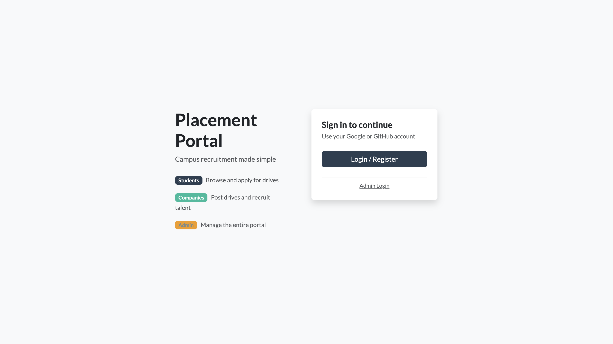
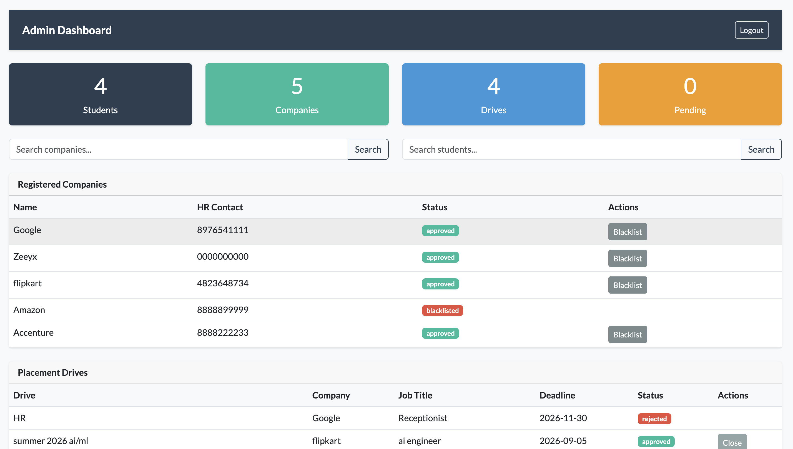
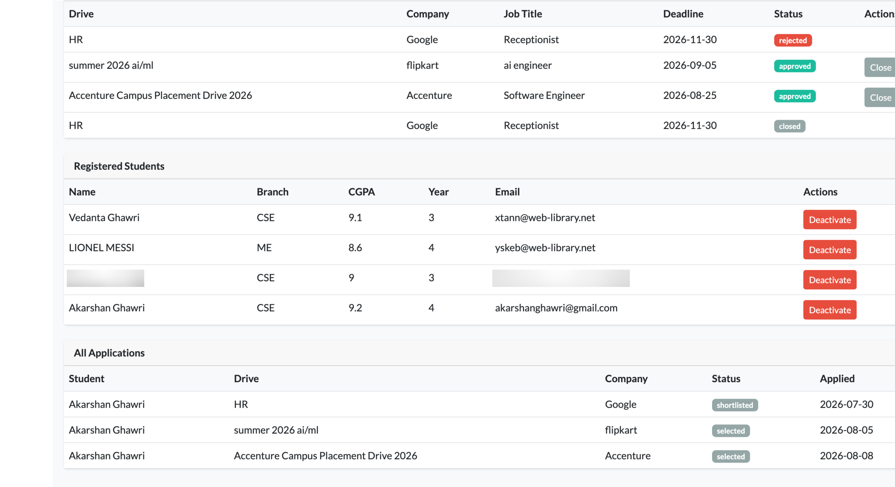
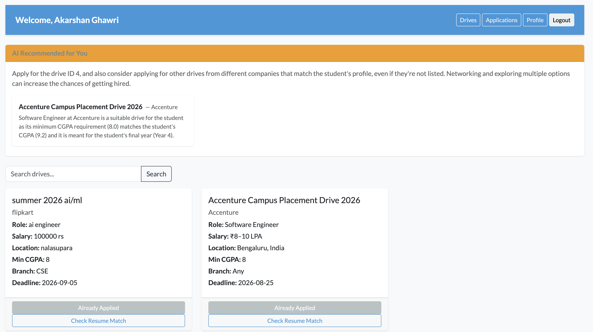
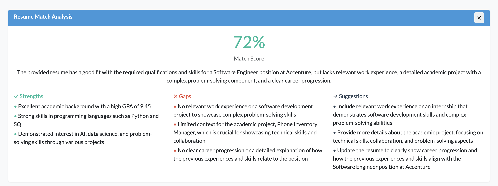
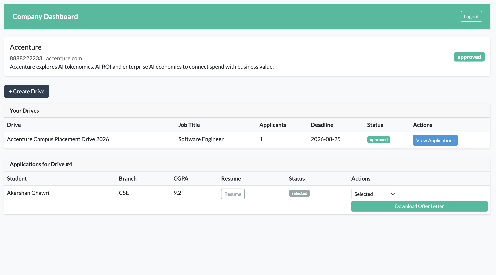

# Placement Portal Application

A full-stack web application for managing campus recruitment built with Flask, Vue.js, Celery, and Redis.

🔗 **Live Demo:** [placement-portal on Render](https://placement-portal-application-9nn7.onrender.com)

---

## Overview
This project started as the App Development 2 final project at IIT Madras BS Degree program and was extended significantly post-submission with production deployment, Clerk OAuth, AI features (ATS resume checker, drive recommendations), Supabase Storage, and Docker support.

Institutes still rely on spreadsheets and manual coordination for campus recruitment, making it difficult to manage company approvals, placement drives, student registrations, and application tracking.

This Placement Portal solves that with three distinct roles — **Admin**, **Company**, and **Student** each with their own dashboard and permissions.

---

## Tech Stack

| Layer | Technology |
|-------|-----------|
| Backend | Flask (REST API) |
| Frontend | Vue.js 3 (CDN) + Bootstrap 5 (Flatly) |
| Database | PostgreSQL (Supabase) |
| Authentication | Clerk (OAuth) + JWT for Admin |
| Background Jobs | Celery + Celery Beat |
| Message Broker / Cache | Redis (Upstash) |
| Email | Flask-Mail (Gmail SMTP) |
| File Storage | Supabase Storage |
| AI Features | Groq (llama-3.1-8b-instant) |
| Containerisation | Docker + docker-compose |

---

## Features

### Admin
- Dashboard with stats — total students, companies, drives, pending approvals
- Approve / reject / blacklist companies
- Approve / reject / close placement drives
- Activate / deactivate students
- Search companies and students
- View all applications across the platform

### Company
- Register via Google / GitHub (Clerk OAuth)
- Create placement drives with eligibility criteria (requires admin approval)
- View and manage student applications
- Update application status — shortlisted, waiting, selected, rejected
- View student resumes
- Generate and download PDF offer letters for selected candidates

### Student
- Register via Google / GitHub (Clerk OAuth)
- Browse approved placement drives with search
- AI-powered drive recommendations based on profile
- Apply for drives (eligibility validated — CGPA, branch, year)
- ATS resume checker — score resume against job description using Groq LLM
- View application history and status
- Upload resume to Supabase Storage
- Export application history as CSV (delivered via email)

### Background Jobs
| Job | Trigger | Description |
|-----|---------|-------------|
| Daily Reminder | Every day at 10am IST | Emails students about upcoming deadlines |
| Monthly Report | 1st of every month | Emails admin an HTML activity report |
| CSV Export | User triggered | Emails student their application history |

---

## Demo Credentials

| Role | How to Access |
|------|--------------|
| Admin | Use Admin Login link on the login page — contact owner for credentials |
| Company | Click Login / Register → sign in with Google or GitHub → complete company profile |
| Student | Click Login / Register → sign in with Google or GitHub → complete student profile |

---

## Screenshots

### Login Page


### Admin Dashboard



### Student Dashboard


### AI Resume Match Analysis


### Company Dashboard


---

## Database Schema

```
User (id, clerk_id, username, email, password, role, is_active)
  ├── Student (id, user_id FK, full_name, branch, cgpa, year, phone, resume_path)
  │     └── Application (id, student_id FK, drive_id FK, applied_at, status, interview_type, remarks)
  └── Company (id, user_id FK, name, hr_contact, website, description, approval_status)
        └── PlacementDrive (id, company_id FK, drive_name, job_title, job_description,
                            salary, location, required_branch, required_cgpa,
                            required_year, application_deadline, status)
```


**Relationships:**
- User → Student (one-to-one)
- User → Company (one-to-one)
- Company → PlacementDrive (one-to-many)
- Student → Application (one-to-many)
- PlacementDrive → Application (one-to-many)
- UniqueConstraint on (student_id, drive_id) prevents duplicate applications

---

## API Endpoints

### Auth
| Method | Endpoint | Description |
|--------|----------|-------------|
| POST | `/api/auth/admin/login` | Admin login — returns JWT token |
| POST | `/api/auth/register/student` | Register student profile (Clerk token required) |
| POST | `/api/auth/register/company` | Register company profile (Clerk token required) |
| GET | `/api/auth/me` | Get current user role from DB |

### Admin (JWT protected)
| Method | Endpoint | Description |
|--------|----------|-------------|
| GET | `/api/admin/stats` | Dashboard stats (cached) |
| GET | `/api/admin/companies` | List all companies with search |
| PUT | `/api/admin/companies/<id>/status` | Approve / reject / blacklist company |
| GET | `/api/admin/students` | List all students with search |
| PUT | `/api/admin/students/<id>/status` | Activate / deactivate student |
| GET | `/api/admin/drives` | List all placement drives (cached) |
| PUT | `/api/admin/drives/<id>/status` | Approve / reject / close drive |
| GET | `/api/admin/applications` | View all student applications |

### Company (Clerk token protected)
| Method | Endpoint | Description |
|--------|----------|-------------|
| GET | `/api/company/dashboard` | Company info and drives |
| POST | `/api/company/drives` | Create a placement drive |
| GET | `/api/company/drives/<id>/applications` | View applications for a drive |
| PUT | `/api/company/applications/<id>/status` | Update application status |
| GET | `/api/company/applications/<id>/offer-letter` | Generate PDF offer letter |

### Student (Clerk token protected)
| Method | Endpoint | Description |
|--------|----------|-------------|
| GET | `/api/student/drives` | View approved drives with search |
| POST | `/api/student/drives/<id>/apply` | Apply for a drive |
| GET | `/api/student/check-resume/<id>` | ATS resume checker via Groq |
| GET | `/api/student/recommendations` | AI drive recommendations via Groq |
| GET | `/api/student/applications` | View own application history |
| GET/PUT | `/api/student/profile` | Get or update student profile |
| POST | `/api/student/upload-resume` | Upload resume to Supabase Storage |
| GET | `/api/student/resume/<filename>` | View resume (redirects to Supabase URL) |
| POST | `/api/student/export` | Trigger async CSV export job |

---

## Project Structure

```
placement_portal_application/
├── app/
│   ├── __init__.py          # App factory, initialises extensions, seeds admin
│   ├── models.py            # SQLAlchemy models
│   ├── clerk_auth.py        # Clerk JWT verification and role decorators
│   ├── auth/
│   │   └── routes.py        # Admin login, Clerk registration, /me endpoint
│   ├── admin/
│   │   └── routes.py        # Admin management endpoints (JWT)
│   ├── company/
│   │   └── routes.py        # Company dashboard and drives (Clerk)
│   ├── student/
│   │   └── routes.py        # Student dashboard, AI features (Clerk)
│   ├── jobs/
│   │   └── tasks.py         # Celery background tasks
│   └── templates/
│       └── index.html       # Single HTML entry point (Clerk CDN loaded here)
├── static/
│   └── js/
│       └── app.js           # Vue.js 3 frontend — all dashboards
├── tests/
│   └── test_auth.py         # pytest test suite
├── celery_worker.py         # Celery app entry point
├── config.py                # Configuration (reads from .env)
├── run.py                   # Flask entry point
├── Dockerfile               # Docker image definition
├── docker-compose.yml       # Multi-service local setup
├── render.yaml              # Render deployment config
├── requirements.txt
├── .env.example
└── README.md
```

---

## Local Setup and Installation

### Prerequisites
- Python 3.10+
- Redis running locally
- Clerk account (for OAuth)
- Supabase account (for DB and storage)

### 1. Clone the repository

```bash
git clone https://github.com/akarshanghawri/placement_portal_application.git
cd placement_portal_application
```

### 2. Create virtual environment

```bash
python3 -m venv .venv
source .venv/bin/activate
```

### 3. Install dependencies

```bash
pip install -r requirements.txt
```

### 4. Configure environment

```bash
cp .env.example .env
```

Edit `.env` with your values — see `.env.example` for all required variables.

### 5. Start Redis

```bash
brew services start redis   # macOS
```

### 6. Run the application

Three terminals required:

```bash
# Terminal 1 — Flask server
python run.py

# Terminal 2 — Celery worker
celery -A celery_worker.celery worker --loglevel=info

# Terminal 3 — Celery beat (scheduler)
celery -A celery_worker.celery beat --loglevel=info
```

Visit `http://localhost:5000`

---

## Docker Setup (Alternative)

Run the entire stack with one command:

```bash
docker compose up --build
```

This starts Flask, Celery worker, Celery beat, and Redis together. Make sure `.env` has the correct values before running.

---

## Default Admin Credentials

Admin is seeded programmatically on first run using `ADMIN_EMAIL` from `.env`.

```
Email:  value of ADMIN_EMAIL in .env
Password: admin123
```

Admin is seeded programmatically on first run. No admin registration is allowed.


---

## Authentication Architecture

| Role | Auth Method | How it works |
|------|-------------|-------------|
| Student | Clerk OAuth | Sign in with Google/GitHub → complete profile form → Clerk token sent with every request |
| Company | Clerk OAuth | Same as student |
| Admin | JWT (Flask-JWT-Extended) | Email + password → JWT token stored in localStorage |

Clerk handles OAuth, session management, and token generation for students and companies. Admin uses a separate JWT flow to avoid Clerk dependency for the institute.

---

## Deployment

The application is deployed on **Render** with the following infrastructure:

| Service | Provider | Notes |
|---------|----------|-------|
| Web app | Render (free tier) | Spins down after inactivity |
| PostgreSQL | Supabase (free) | Persistent, always on |
| Redis | Upstash (free) | Caching and Celery broker |
| File Storage | Supabase Storage | Resume uploads, persistent |

### Note on Background Jobs

The Celery worker and beat scheduler are not deployed on the live server due to Render's free tier limitations (750 hours/month shared across services). Background jobs can be run locally pointing to the live Supabase and Upstash instances:

```bash
# Make sure .env has the Supabase and Upstash URLs
celery -A celery_worker.celery worker --loglevel=info
celery -A celery_worker.celery beat --loglevel=info
```